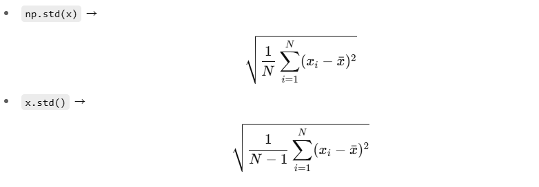
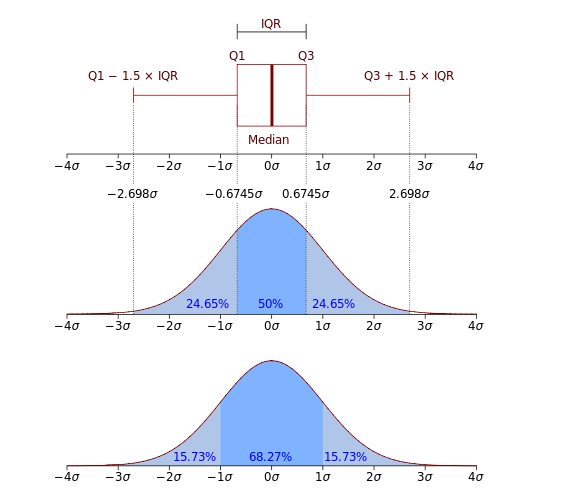

## 작업형2 무작정 따라해보기
- X: 독립변수
- y: 종속변수

### 데이터 구조 확인
- read_csv는 ,로 데이터 구분함 -> ex. \t로 구분되어있는경우,
  - sep or delimiter 옵션 추가 
```py
df = pd.read_csv('https://raw.githubusercontent.com/Datamanim/pandas/main/lol.csv', sep='\t')
```
- df.info(): 각 컬럼의 데이터 수, 데이터 타입 한번에 확인
- df.describe(): 각 수치형 변수의 분포(사분위, 평균, 표준편차, 최대, 최소) 확인
- .isnull().sum(): 각 컬럼별 결측치 개수 출력
- .shape: (행수, 열수)
- .fillna(k): k를 결측치에 채움
- .head(): 기본값 5개. 특정 컬럼의 위에서 부터 5개 값만 보여줌. 개수 지정가능
- .tail(): 기본값 5개. 특정 컬럼의 아래에서부터 5개 값만 보여줌.
- df['city'].unique(): city 컬럼의 종류 확인
  - 유일값 개수 : .nunique()
---
- 수치형 변수를 가진 컬럼 출력 
   - 일반적으로, exclude=object 사용
```py
df.select_dtypes(exclude=object).columns
```
- 범주형 변수를 가진 컬럼 출력
```py
df.select_dtypes(include=object).columns
```

### 행/열 삭제
1. axis 방식
```py
df.drop([0, 3], axis=0) # 행 삭제(axis=0)
df.drop(['age', 'f1'], axis=1) # 컬럼 삭제(axis=1)
```
2. 명시적 방식
```py
df.drop(index=[0, 3])   # 행 삭제(index)
df.drop(columns=['age', 'f1'])  # 컬럼 삭제(columns)
```

- .reset_index(drop=True): 기존 index제거 후, 새로운 인덱스 0부터 정렬

## tutorial T1 2회 기출유형
- .sort_values('f5', ascending=False) : f5컬럼 내림차순정렬

```py
# 'age' 컬럼 >= 80 인 데이터의 'f5' 컬럼 평균값 구하기
print(df[df['age']>=80]['f5'].mean())
```

- .iloc[행위치, 열위치]: 데이터프레임의 행위치, 열위치를 지정해서 작업수행   
-> 전체 데이터프레임의 구조를 보고 위치 확인해서 지정하는 형태
```py
# 데이터프레임의 0~9 행 의 -1열에 min값을 넣겠다.
df.iloc[:10,-1] = min
```

### 데이터 나누는 법
```py
# 데이터 셋의 앞에서 순서대로 70% 데이터만 활용해서...

# 1. 순서대로 데이터를 나누는 방법
data70, data30 = np.split(df, [int(.7*len(df))])

# 2. 랜덤으로 데이터를 나누는 방법 -> .sample 사용
data70 = df.sample(frac=0.7)  # 랜덤으로 70%의 데이터를 뽑음
data30 = df.drop(data70.index)  # 랜덤으로 뽑은 70%를 원래 df에서 drop -> 남은게 나머지 30

data70.tail()   # 아래에서 5개 데이터만 확인
```

### 표준편차 구하기
1. 모집단(데이터가 전체 일 때)
```py
np.std(data70['f1'])
```
2. 표본(데이터가 전체의 일부(샘플)일 때)
=> 대체로 얘를 쓰는게 맞을듯...
```py
data70['f1'].std()
```


---   
- 논리 연산자 사용 시 
각 조건에 대한 괄호 구분 명확히 해줘야됨!!!
```py
print(df[df['age'] > (med + 1.5*std) | df['age'] < (med - 1.5*std)]['age'].sum())  # TypeError 발생
print(df[(df['age'] > (med + 1.5*std)) | (df['age'] < (med - 1.5*std))]['age'].sum())  # ok

```

- .loc: 내부 조건을 사용해서 True/False로 필터링하고 True인 행만 가져옴
```py
# 이상치 상한 벗어나는 애들 필터링 + 이상치 하한 벗어나는 애들 필터링
df.loc[(df['age'] > max)]['age'].sum() + df.loc[(df['age'] < min)]['age'].sum()
```

# titanic IQR 문제 (T1-1)
## IQR vs. std
- IQR: 데이터 분포 모양에 아무런 가정 X
- std: 데이터가 정규분포를 따른다는 가정 필요 -> 평균을 기준으로 대칭, 이상치에 민감

---

std로 바로 2.698*std 하면 안됨 <br>
med 기준 0.75, 0.25 -> Q3, Q1
구한 후, 
<br>
IQR로 이상치 한계값 계산 <br>

**IQR = Q3 - Q1**

- .quantile(): 데이터에서 분위수를 구하는 함수 
```py
df['Fare'].quantile(0.25) # 25% 위치 (Q1, 1사분위수)
df['Fare'].quantile(0,75) # 75% 위치 (Q3, 3사분위수)
```
---
## Titanic 소수점 (T1-2)
### 주어진 데이터에서 이상치(소수점 나이)를 찾고 올림, 내림, 버림 했을때 3가지 모두 'age' 평균을 구한 다음 모두 더하여 출력하시오
- np.ceil(): 올림
- np.floor(): 내림
- np.trunc(): 버림
---

### 왜도(비대칭도)
: .skew()<br>
: 실수 값 확률 변수의 확률 분포 비대칭성을 나타내는 지표
- 왜도 < 0 : 확률밀도함수의 왼쪽 부분에 긴 꼬리, 중앙값을 포함한 자료가 오른쪽에 더 많이 분포
- 왜도 > 0 : 오른쪽 부분에 긴 꼬리, 자료가 왼쪽에 더 많이 분표
- 왜도 = 0 : 평균 == 중앙값

### 첨도
: .kurt()<br>
: 확률분포의 꼬리가 두꺼운 정도. 극단적인 편차 또는 이상치가 많을 수록 큰 값 가짐. <br>
- 첨도값(K): 3에 가까울 수록 정규분포에 가까움
- K < 3: 정규분포보다 꼬리가 얇은 분포
- K > 3: 정규분포보다 꼬리가 두꺼운 분포

### 로그 변환
:np.log1p()

### 시각화
df.hist() -> 단.. 시험에선 시각화 사용 불가!!!

### k를 소수점 n자리까지 출력
round(k, n)

### 절대값
np.abs()


### quantity , item_price 두개의 컬럼으로 구성된 새로운 데이터 프레임을 정의하라
```py
df[['quantity', 'item_price']]
```

### 데이터 형변환
- .astype('float'): float 타입으로 변환

### 특정 컬럼(new_price) 값 기준 오름차순 정렬
df.sort_values('new_price')
- cf. 내림차순 정렬
df.sort_values('new_price', ascending=False)

### df의 item_name 컬럼 값중 Chips 포함하는 경우의 데이터를 출력하라
- contains는 str 관련 함수
df[df.item_name.str.contains('Chips')]

### df의 짝수번째 컬럼만을 포함하는 데이터프레임을 출력하라
```py
df.iloc[:, ::2]
```

### df의 item_name 컬럼 값이 Steak Salad 또는 Bowl 인 데이터를 데이터 프레임화 한 후, 
1. item_name를 기준으로 중복행이 있으면 제거하되 첫번째 케이스만 남겨라
```py
ans = df[(df['item_name'] == 'Steak Salad') | (df['item_name'] == 'Bowl')]
# item_name를 기준으로 중복행이 있으면 제거하되 첫번째 케이스만 남겨라
ans = ans.drop_duplicates('item_name')
```
2. item_name을 기준으로 중복행이 있으면 제거하되, 마지막 케이스만 남겨라
```py
ans = df[(df['item_name'] == 'Steak Salad') | (df['item_name'] == 'Bowl')]
ans = ans.drop_duplicates('item_name', keep='last')
```

### 36. df의 데이터 중 item_name의 값이 Izze 데이터를 Fizzy Lizzy로 수정하라
```py
# df[행 조건, 열 이름] = 새로운 값
# 데이터 프레임을 조건으로 필터링하고, 
# 해당 조건의 셀을 직접 수정
df[df['item_name']== 'Izze', 'item_name'] = 'Fizzy Lizzy'
```

### 40. df의 데이터 중 choice_description 값에 Vegetables 들어가지 않는 경우의 갯수를 출력하라
```py
len(df[~df['choice_description'].str.contains('Vegetables')])
```

### df의 데이터 중 item_name 값이 N으로 시작하는 데이터를 모두 추출하라
- .str.startswith('')
```py
df[df['item_name'].str.startswith('N')]
```

### df의 데이터 중 item_name 값의 단어갯수가 15개 이상인 데이터를 인덱싱하라
df[df['item_name'].str.len()>=15]

### df의 데이터 중 new_price값이 lst에 해당하는 경우의 데이터 프레임을 구하고 그 갯수를 출력하라 
- lst =[1.69, 2.39, 3.39, 4.45, 9.25, 10.98, 11.75, 16.98]
```py
df[df['new_price'].isin(lst)]
```
---
**+.str을 사용하는 경우...**
Pandas에서 문자열 데이터를 담고 있는 Series에 문자열 관련 메서드(len, lower, contains.. 등)를 적용하려면 <br>
.str을 통해 *문자열 전용 벡터화 인터페이스*에 접근해야됨. <br>
- 반복문 없이 내부적으로 벡터화 처리
```py
df['col'].str.len() # 'col'컬럼의 각 문자열 원소에 대해 .len() 적용
len(df['col'])  # Series 전체의 길이(즉, 행 개수)
```