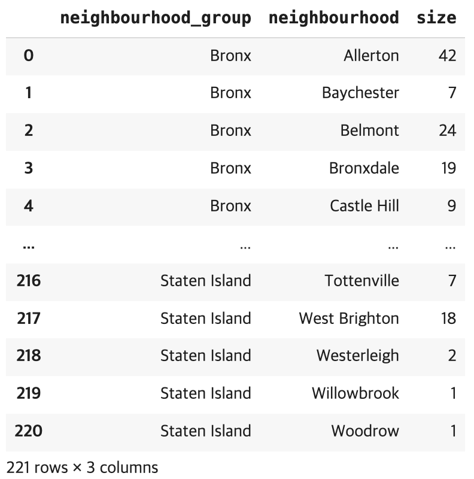
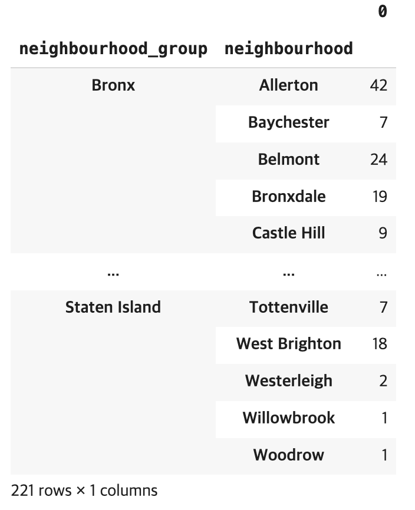

### help(), dir()
- dir(): 메서드 종류
- help(): 사용법 공식문서

### 작업형2 무작정 따라해보기
- X: 독립변수
- y: 종속변수

### 데이터 구조 확인
- **Series: 인덱스를 가진 1차원 배열**
- read_csv는 ,로 데이터 구분함 -> ex. \t로 구분되어있는경우,
  - sep or delimiter 옵션 추가 
```py
df = pd.read_csv('https://raw.githubusercontent.com/Datamanim/pandas/main/lol.csv', sep='\t')
```
- df.info(): 각 컬럼의 데이터 수, 데이터 타입 한번에 확인
- df.describe(): 각 수치형 변수의 분포(사분위, 평균, 표준편차, 최대, 최소) 확인
- .isnull().sum(): 각 컬럼별 결측치 개수 출력
- .shape: (행수, 열수)
- .fillna(k): k를 결측치에 채움
- .head(): 기본값 5개. 특정 컬럼의 위에서 부터 5개 값만 보여줌. 개수 지정가능
- .tail(): 기본값 5개. 특정 컬럼의 아래에서부터 5개 값만 보여줌.
- df['city'].unique(): city 컬럼의 종류 확인
  - 유일값 개수 : .nunique()
- .read_csv(index_col=k): k열을 index 컬럼으로 쓰겠다는 뜻
  - 인덱스를 위한 열이 지정되어있으면 명시적으로 처리해주는게 좋음
---
- 수치형 변수를 가진 컬럼 출력 
   - 일반적으로, exclude=object 사용
```py
df.select_dtypes(exclude=object).columns
```
- 범주형 변수를 가진 컬럼 출력
```py
df.select_dtypes(include=object).columns
```
---
### 데이터 타입 변경
1. pd.to_ 형태
: datetime, int,float, timedelta 데이터 타입으로 변경
```py
pd.to_datetime()  # 날짜/시간
pd.to_numeric()   # 수치형
pd.to_timedelta() # 시간 간격
```
2. .astype()
: 그 외 데이터 타입 변경
```py
df['category_col'] = df['category_col'].astype('category')  # 'category' 데이터 타입으로 변경하려는 경우 (Pandas 제공 데이터타입)
df['int_col'] = df['int_col'].astype(int)
```


### 행/열 삭제
1. axis 방식
```py
df.drop([0, 3], axis=0) # 행 삭제(axis=0)
df.drop(['age', 'f1'], axis=1) # 컬럼 삭제(axis=1)
```
2. 명시적 방식
```py
df.drop(index=[0, 3])   # 행 삭제(index)
df.drop(columns=['age', 'f1'])  # 컬럼 삭제(columns)
```

- .reset_index(drop=True): 기존 index제거 후, 새로운 인덱스 0부터 정렬

## tutorial T1 2회 기출유형
- .sort_values('f5', ascending=False) : f5컬럼 내림차순정렬

```py
# 'age' 컬럼 >= 80 인 데이터의 'f5' 컬럼 평균값 구하기
print(df[df['age']>=80]['f5'].mean())
```

- .iloc[행위치, 열위치]: 데이터프레임의 행위치, 열위치를 지정해서 작업수행   
-> 전체 데이터프레임의 구조를 보고 위치 확인해서 지정하는 형태
```py
# 데이터프레임의 0~9 행 의 -1열에 min값을 넣겠다.
df.iloc[:10,-1] = min
```

### 데이터 나누는 법
```py
# 데이터 셋의 앞에서 순서대로 70% 데이터만 활용해서...

# 1. 순서대로 데이터를 나누는 방법
data70, data30 = np.split(df, [int(.7*len(df))])

# 2. 랜덤으로 데이터를 나누는 방법 -> .sample 사용
data70 = df.sample(frac=0.7)  # 랜덤으로 70%의 데이터를 뽑음
data30 = df.drop(data70.index)  # 랜덤으로 뽑은 70%를 원래 df에서 drop -> 남은게 나머지 30

data70.tail()   # 아래에서 5개 데이터만 확인
```

### 표준편차 구하기
1. 모집단(데이터가 전체 일 때)
```py
np.std(data70['f1'])
```
2. 표본(데이터가 전체의 일부(샘플)일 때)
=> 대체로 얘를 쓰는게 맞을듯...
```py
data70['f1'].std()
```


---   
- 논리 연산자 사용 시 
각 조건에 대한 괄호 구분 명확히 해줘야됨!!!
```py
print(df[df['age'] > (med + 1.5*std) | df['age'] < (med - 1.5*std)]['age'].sum())  # TypeError 발생
print(df[(df['age'] > (med + 1.5*std)) | (df['age'] < (med - 1.5*std))]['age'].sum())  # ok

```

- .loc: 내부 조건을 사용해서 True/False로 필터링하고 True인 행만 가져옴
```py
# 이상치 상한 벗어나는 애들 필터링 + 이상치 하한 벗어나는 애들 필터링
df.loc[(df['age'] > max)]['age'].sum() + df.loc[(df['age'] < min)]['age'].sum()
```

# titanic IQR 문제 (T1-1)
## IQR vs. std
- IQR: 데이터 분포 모양에 아무런 가정 X
- std: 데이터가 정규분포를 따른다는 가정 필요 -> 평균을 기준으로 대칭, 이상치에 민감

---

std로 바로 2.698*std 하면 안됨 <br>
med 기준 0.75, 0.25 -> Q3, Q1
구한 후, 
<br>
IQR로 이상치 한계값 계산 <br>

**IQR = Q3 - Q1**

- .quantile(): 데이터에서 분위수를 구하는 함수 
```py
df['Fare'].quantile(0.25) # 25% 위치 (Q1, 1사분위수)
df['Fare'].quantile(0,75) # 75% 위치 (Q3, 3사분위수)
```
---
## Titanic 소수점 (T1-2)
### 주어진 데이터에서 이상치(소수점 나이)를 찾고 올림, 내림, 버림 했을때 3가지 모두 'age' 평균을 구한 다음 모두 더하여 출력하시오
- np.ceil(): 올림
- np.floor(): 내림
- np.trunc(): 버림
---

### 왜도(비대칭도)
: .skew()<br>
: 실수 값 확률 변수의 확률 분포 비대칭성을 나타내는 지표
- 왜도 < 0 : 확률밀도함수의 왼쪽 부분에 긴 꼬리, 중앙값을 포함한 자료가 오른쪽에 더 많이 분포
- 왜도 > 0 : 오른쪽 부분에 긴 꼬리, 자료가 왼쪽에 더 많이 분표
- 왜도 = 0 : 평균 == 중앙값

### 첨도
: .kurt()<br>
: 확률분포의 꼬리가 두꺼운 정도. 극단적인 편차 또는 이상치가 많을 수록 큰 값 가짐. <br>
- 첨도값(K): 3에 가까울 수록 정규분포에 가까움
- K < 3: 정규분포보다 꼬리가 얇은 분포
- K > 3: 정규분포보다 꼬리가 두꺼운 분포

### 로그 변환
:np.log1p()

### 시각화
df.hist() -> 단.. 시험에선 시각화 사용 불가!!!

### k를 소수점 n자리까지 출력
round(k, n)

### 절대값
np.abs()


### quantity , item_price 두개의 컬럼으로 구성된 새로운 데이터 프레임을 정의하라
```py
df[['quantity', 'item_price']]
```

### 데이터 형변환
- .astype('float'): float 타입으로 변환

### 특정 컬럼(new_price) 값 기준 오름차순 정렬
df.sort_values('new_price')
- cf. 내림차순 정렬
df.sort_values('new_price', ascending=False)

### df의 item_name 컬럼 값중 Chips 포함하는 경우의 데이터를 출력하라
- contains는 str 관련 함수
df[df.item_name.str.contains('Chips')]

### df의 짝수번째 컬럼만을 포함하는 데이터프레임을 출력하라
```py
df.iloc[:, ::2]
```

### df의 item_name 컬럼 값이 Steak Salad 또는 Bowl 인 데이터를 데이터 프레임화 한 후, 
1. item_name를 기준으로 중복행이 있으면 제거하되 첫번째 케이스만 남겨라
```py
ans = df[(df['item_name'] == 'Steak Salad') | (df['item_name'] == 'Bowl')]
# item_name를 기준으로 중복행이 있으면 제거하되 첫번째 케이스만 남겨라
ans = ans.drop_duplicates('item_name')
```
2. item_name을 기준으로 중복행이 있으면 제거하되, 마지막 케이스만 남겨라
```py
ans = df[(df['item_name'] == 'Steak Salad') | (df['item_name'] == 'Bowl')]
ans = ans.drop_duplicates('item_name', keep='last')
```

### 36. df의 데이터 중 item_name의 값이 Izze 데이터를 Fizzy Lizzy로 수정하라
```py
# df[행 조건, 열 이름] = 새로운 값
# 데이터 프레임을 조건으로 필터링하고, 
# 해당 조건의 셀을 직접 수정
df[df['item_name']== 'Izze', 'item_name'] = 'Fizzy Lizzy'
```

### 40. df의 데이터 중 choice_description 값에 Vegetables 들어가지 않는 경우의 갯수를 출력하라
```py
len(df[~df['choice_description'].str.contains('Vegetables')])
```

### df의 데이터 중 item_name 값이 N으로 시작하는 데이터를 모두 추출하라
- .str.startswith('')
```py
df[df['item_name'].str.startswith('N')]
```

### df의 데이터 중 item_name 값의 단어갯수가 15개 이상인 데이터를 인덱싱하라
df[df['item_name'].str.len()>=15]

### df의 데이터 중 new_price값이 lst에 해당하는 경우의 데이터 프레임을 구하고 그 갯수를 출력하라 
- lst =[1.69, 2.39, 3.39, 4.45, 9.25, 10.98, 11.75, 16.98]
```py
df[df['new_price'].isin(lst)]
```
---
**+.str을 사용하는 경우...**
Pandas에서 문자열 데이터를 담고 있는 Series에 문자열 관련 메서드(len, lower, contains.. 등)를 적용하려면 <br>
.str을 통해 *문자열 전용 벡터화 인터페이스*에 접근해야됨. <br>
- 반복문 없이 내부적으로 벡터화 처리
```py
df['col'].str.len() # 'col'컬럼의 각 문자열 원소에 대해 .len() 적용
len(df['col'])  # Series 전체의 길이(즉, 행 개수)
```


### 데이터의 각 host_name의 빈도수를 구하고 host_name으로 정렬하여 상위 5개를 출력하라
- sort_index(): 알파벳 순 정렬 (host_name 기준)
- sort_values(): 빈도수 기준 정렬
```py
# groupby() -> groupby객체를 반환(series반환이 x) 
# groupby객체는 후속 연산을 해야 의미있는 값을 반환!!
df.groupby('host_name').size().sort_index()

# value_counts()는 빈도수 기준으로 자동 내림차순 정렬
# host_name으로 다시 정렬하기 위해서 sort_index()사용
df['host_name'].value_counts().sort_index()

```
- .value_counts() : 고유값의 빈도 수 계산
  - Series 객체에만 사용 가능
  - 자동으로 (빈도 수 기준) 내림차순 정렬
  - 빈도 수 기준으로 정렬해서 Series를 반환!!!!! 
  
### 46. 새로운 데이터 프레임 생성, 컬럼 명명
데이터의 각 host_name의 빈도수를 구하고 빈도수 기준 내림차순 정렬한 데이터 프레임을 만들어라. 빈도수 컬럼은 counts로 명명하라
```py
df.groupby('host_name').size().to_frame().rename(columns={0:'counts'}).sort_values('counts', ascending=False)
```

### 조합 단위 기준 그룹화
```py
df.groupby(['neighbourhood_group', 'neighbourhood'], as_index=False).size()
```
- 'neighbourhood_group' + 'neighbourhood' 조합 단위 기준으로 그룹화
- as_index=False: 일반적으로 groupby()는 그룹 기준 컬럼들을 결과의 인덱스로 사용
  - 그룹 기준 컬럼들을 인덱스가 아니라 일반 컬럼으로 유지
  - size()는 항상 Series를 반환하므로 as_index=False는 무시됨 <br>
    -> 실제로는 인덱스를 갖는 Series를 반환함......?
  - as_index=False
  
  - as_index 옵션 설정 x
  
- size(): 각 그룹이 몇 개의 행을 갖는지 계산

### neighbourhood_group의 값에 따른 neighbourhood컬럼 값 중 neighbourhood_group그룹의 최댓값들을 출력하라
```py
df.groupby(['neighbourhood_group', 'neighbourhood'], as_index=False).size().groupby(['neighbourhood_group'], as_index=False).max()
```

### 여러 통계 함수 동시에 적용
```py
df[['neighbourhood_group','price']].groupby('neighbourhood_group').agg(['mean','var','max','min'])
```

### 50. neighbourhood_group 값에 따른 reviews_per_month 평균, 분산, 최대, 최소 값을 구하여라
```py
df[['neighbourhood_group', 'reviews_per_month']].groupby('neighbourhood_group').agg(['mean', 'var', 'max', 'min'])

# agg 적용 컬럼 명시
df[['neighbourhood_group', 'reviews_per_month']].groupby('neighbourhood_group').agg({'reviews_per_month': ['mean', 'var', 'max', 'min']})
```
- 명시하지 않아도, groupby에 포함되지 않은 컬럼이 자동으로 집계 대상이 됨

### 52. 계층적 인덱싱
neighbourhood 값과 neighbourhood_group 값에 따른 price 의 평균을 계층적 indexing 없이 구하라
```py
df.groupby(['neighborhood', 'neighborhood_group']).price.mean().unstack()
```
- .unstack(): MultiIndex를 평평하게 만듦 => 2차원 표 형태로 만듦

### 55. 데이터중 neighbourhood_group 값에 따른 room_type 컬럼의 숫자를 구하고 neighbourhood_group 값을 기준으로 각 값의 비율을 구하여라
```py
ans = df[['neighbourhood_group', 'room_type']].groupby(['neighbourhood_group', 'room_type']).size().unstack()
ans.loc[:,:] = (ans.values / ans.sum(axis=1).values.reshape(-1,1))
```
- 원본 데이터 값 / (행별합계의 값 -> 브로드캐스팅 열 벡터 변형..)
- 브로드캐스팅: 서로 모양이 다른 배열을 자동으로 확장시켜서 연산 가능하게 해줌


### 57. map
Income_Category의 카테고리를 map 함수를 이용하여 다음과 같이 변경하여 newIncome 컬럼에 매핑하라 Unknown : N
Less than $40K : a
$40K - $60K : b
$60K - $80K : c
$80K - $120K : d
$120K +’ : e
```py
# 1. lambda 사용
dic = {
    'Unknown'        : 'N',
    'Less than $40K' : 'a',
    '$40K - $60K'    : 'b',
    '$60K - $80K'    : 'c',
    '$80K - $120K'   : 'd',
    '$120K +'        : 'e'   
}

df['newIncome']  =df.Income_Category.map(lambda x: dic[x])

Ans = df['newIncome']

# 2. 직접 나열.. 
df['newIncome'] = df['Income_Category'].map({'Unknown': 'N', 'Less than $40K': 'a', '$40K - $60K': 'b', '$60K - $80K': 'c', '$80K - $120K': 'd', '$120K +': 'e'})
```
- lambda x: dic[x] : 각 x에 대해 dic[x] 값을 리턴하라


### 58. apply 함수
```py
df['AgeState']  = df.Customer_Age.map(lambda x: x//10 *10)
df['AgeState'].value_counts().sort_index()
```

### 60. Education_Level의 값중 Graduate단어가 포함되는 값은 1 그렇지 않은 경우에는 0으로 변경하여 newEduLevel 컬럼을 정의하고 빈도수를 출력하라
```py
# 1. map, lambda 사용
df['newEduLevel'] = df['Education_Level'].map(lambda x: 1 if 'Graduate' in x else 0)

# 2. apply 사용
def changeEdu(x):
  if 'Graduate' in x:
    return 1
  else:
    return 0

df['newEduLevel'] = df['Education_Level'].apply(changeEdu)
df['newEduLevel'].value_counts()
```

### 62. Marital_Status 컬럼값이 Married 이고 Card_Category 컬럼의 값이 Platinum인 경우 1 그외의 경우에는 모두 0으로 하는 newState컬럼을 정의하라. newState의 각 값들의 빈도수를 출력하라
**행 단위 체크**
```py
def check(x):
  if x.Marital_Status == 'Married' and x.Card_Category == 'Platinum':
    return 1
  else:
    return 0

df['newState'] = df.apply(check, axis=1)  # axis=1 -> 행 단위로 check함수 적용
# df.apply(check) -> check 함수를 열 단위로 적용!!!!
df['newState'].value_counts()
```

### 66. Yr_Mo_Dy에 존재하는 년도의 유일값을 모두 출력하라
**datetime 타입**
```py
df['Yr_Mo_Dy'].dt.year.unique()
```

### datetime / typestamp
- pd.to_datetime() 사용 시 <br>
  - Series 전체의 dtype -> datetime64[ns] <br>
  - 개별 원소(값) -> pandas.Timestamp

### .dt.weekday vs. .dt.day_name()
- .dt.weekday : 월요일 = 0, 화요일 = 1 ... 일요일 = 6 으로 반환
- .dt.day_name(): 요일 이름으로 변환


### 72. 모든 결측치는 컬럼기준 직전의 값으로 대체하고 첫번째 행에 결측치가 있을경우 뒤에있는 값으로 대채하라
- .fillna(method='ffill'): 앞 값으로 채움
- .fillna(method='bfill'): 뒤 값으로 채움 
```py
# 먼저 ffill로 앞의 값으로 채우고,
# 앞쪽에 값이 없어서 못 채워진 결측치 있으면
# bfill로 뒤의 값으로 채움
df = df.fillna(method='ffill').fillna(method='bfill')
```

### 73. 년도-월 을 기준으로 groupby
```py
# 월 기준 묶음
ans = df.groupby(df['Yr_Mo_Dy'].dt.month).mean()

# 년도-월 기준으로 묶음
ans = df.groupby(df['Yr_Mo_Dy'].dt.to_period('M')).mean()
```

### 74. 1차 차분
RPT 컬럼의 값을 일자별 기준으로 1차차분하라
```py
ans = df['RPT'].diff()
```

### 75. 이동평균값
RPT와 VAL의 컬럼을 일주일 간격으로 각각 이동평균한값을 구하여라
- .rolling(k): 앞에서부터 k개의 값을 기준으로 평균값 계산
  - k개씩 윈도우를 잡아 이동하며 계산
  - 윈도우 한 칸씩 이동하면서 다음 평균 계산
```py
ans = df[['RPT', 'VAL']].rolling(7).mean()
```

### 79. 시간이 연속적으로 존재하며 결측치가 없는지 확인하라
**시간을 차분했을 경우 첫 값은 NaN, 이후 모든 차분값이 동일하면 연속이라 판단함**
```py
# .diff(): datetime 간의 간격 계산
#   .diff()의 첫 값: 무조건 NaT(Not a Time) => 연속이라면, 항상 NaT 포함 두 개의 유일값이 생김 (아니면 3개 이상의 값이 나올 것)
# .unique(): 고유한 시간 간격 종류 수 

check = len(df['(년-월-일:시)'].diff().unique())
if check == 2:
  ans = True
else:
  ans = False
```

### 81. 날짜 컬럼을 index로 만들어라
```py
df.set_index('(년-월-일:시)', inplace=True, drop=True)
```
**inplace**
- inplace=True : df 자체가 바뀜. 리턴값 없음
- inplace=False: 원본 df는 그대로, 바뀐 DataFrame이 리턴됨
**drop**
- drop=True: 인덱스로 쓴 컬럼은 열에서 제거됨
- drop=False: 인덱스로 쓴 컬럼이 열에도 남아 있음(중복)

### 82. 데이터를 주단위로 뽑아서 최소,최대, 평균, 표준표차를 구하여라
**resample**
: 시간 인덱스를 기준으로 데이터를 재조정(리샘플링)하는 메서드
-> 전제조건: df가 반드시 datetime 형식의 인덱스를 가져야됨
- 리샘플링 단위
  - 'D': 일 단위
  - 'W': 주 단위
  - 'M': 월단위(월말 기준) -> 매달 말일 기준 묶음
  - 'MS': 월단위(월초 기준) -> 매달 1일 기준 묶음
  - 'Q': 분기 마지막 달 기준 -> 3,6,9,12월 말 기준
  - 'Y': 연말(12월 31일)기준
  - 'YS': 1월 1일 기준
  - 'H': 1시간 단위
  - 'T' or 'min': 분단위
  - 'S': 초 단위
  - 2W , 3D.. 등등도 가능

```py
df.resample('W').agg(['min', 'max', 'mean', 'std'])
```

### 83. .str 접근자
: 문자열 메서드를 벡터화해서 쓸 수 있도록 .str 접근자 제공
- Series에는 python의 str.split(), str.replace() 같은 문자열 전용 메서드가 적용되지 x
```py
df['First Tooltip'] = df['First Tooltip'].str.split('[').str[0].astype(float)
# df['First Tooltip'] = df['First Tooltip'].map(lambda x: float(x.split("[")[0]))
```

### 86. Dim1에 따른 년도별 사망비율의 평균을 구하라 (pivot vs. pivot_table)
- .pivot: 중복값허용x, 집계함수x
- .pivot_table(): 중복값허용o, 집계함수o(aggfunc())

### 91. concat
: 시리즈나 데이터를 이어붙일 때 쓰는 함수

### 93. transpose (전치)
: 행과 열을 뒤바꾸는 연산
- .transpose, .T

### 94. merge 함수
- key: 합칠 때의 기준 열
- 양쪽 테이블의 기준 열이 다른 경우 left_key, right_key로 다르게 지정

### join
- 공통된 부분만 합치기: inner
- 전체 다 합치기: outer

