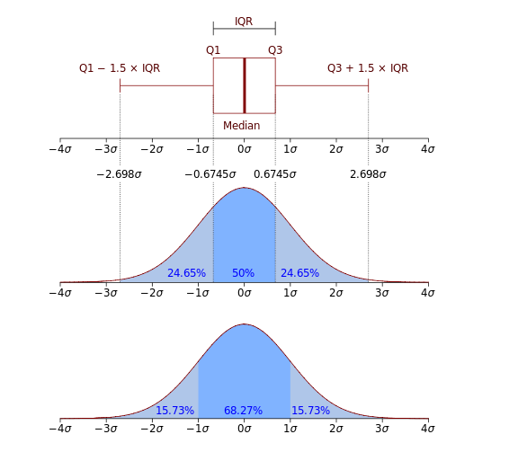

## IQR vs. std
- IQR: 데이터 분포 모양에 아무런 가정 X
- std: 데이터가 정규분포를 따른다는 가정 필요 -> 평균을 기준으로 대칭, 이상치에 민감

---

std로 바로 2.698*std 하면 안됨 <br>
med 기준 0.75, 0.25 -> Q3, Q1
구한 후, 
<br>
IQR로 이상치 한계값 계산 <br>

**IQR = Q3 - Q1**

- .quantile(): 데이터에서 분위수를 구하는 함수 
```py
df['Fare'].quantile(0.25) # 25% 위치 (Q1, 1사분위수)
df['Fare'].quantile(0,75) # 75% 위치 (Q3, 3사분위수)
```